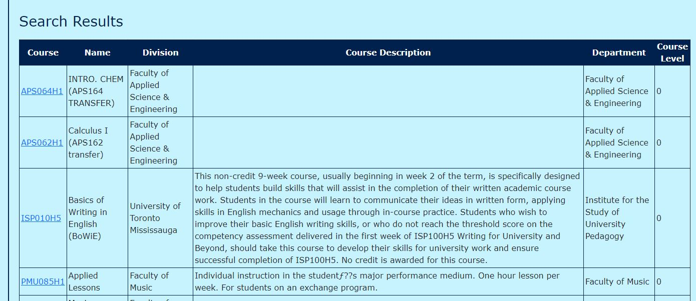

# ECE444 Lab 5
Dennis Lam, Joseph Sawaya

## Description
This repository is a clone of https://github.com/nelaturuk/education_pathways.

## Repository files:

`./Procfile ./wsgi.py` *tells gunicorn how to run the program*

`./environment.yml  ./requirements.txt` *specifies python requirements for anaconda and pip respectively*

`./__init__.py` *main flask code*

`./readme.md` *this file*

`./resources:` *contains datasets used in the program*

`course_vectorizer.pickle df_processed.pickle`

`course_vectors.npz       graph.pickle`

`./static:` *contains any static elements of the webpage, in this case just the CARTE logo*
`CARTE_logo.jpg`

`./templates:` *contains flask templates for rendering HTML*

`_formhelpers.html course.html       index.html        results.html`

## Activity 1:

## Activity 2-5:

**Home Page**
 

 

**Results Page – Form**
 

 

**Results Page – Results Table**
 

## Activity 6:

**User Story 1.1 – Dropdown Search Bar**
 

**User Story 1.2 – Search Filter**
 

**User Story 2.2 – Syllabus Access**
 

